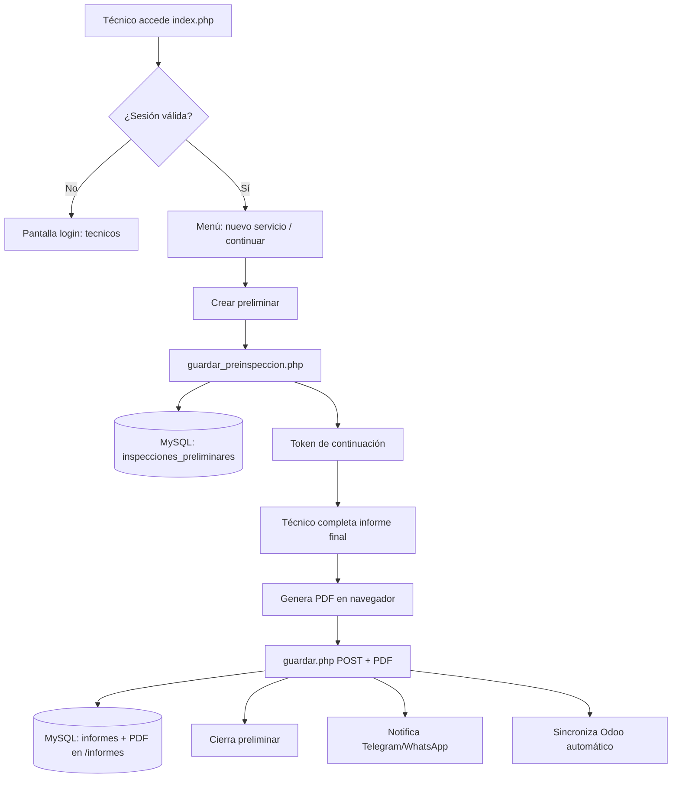
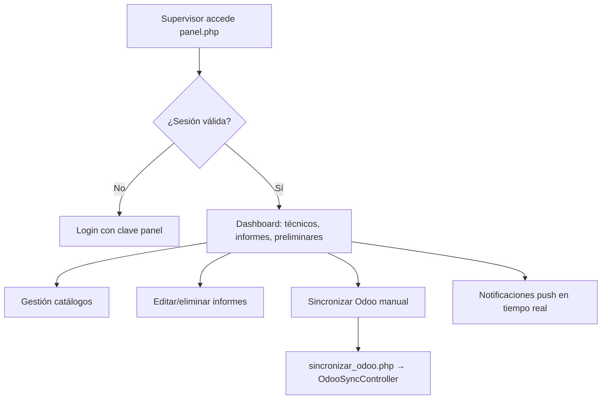

# Funcionamiento del Sistema ZGROUP Informes Técnicos

Documento de referencia para operación, mantenimiento y evolución del proyecto.  
Versión del sistema: **V53** | Base de datos: **MySQL (InnoDB, utf8mb4)**

---

## 1. Resumen ejecutivo

ZGROUP Informes es una aplicación web PHP que permite a **técnicos de campo** registrar:

1. **Inspecciones preliminares** — estado inicial del equipo antes del trabajo.
2. **Informes técnicos finales** — trabajo realizado, repuestos, PDF generado en cliente.

Los **supervisores** acceden a un panel privado para consultar, editar, eliminar informes, gestionar catálogos y sincronizar PDFs con **Odoo**. El sistema envía alertas por **Telegram**, **WhatsApp Cloud API** y **OneSignal Push**.

---

## 2. Validación del proyecto (auditoría)

### 2.1 Estado general

| Aspecto | Estado | Observación |
|---------|--------|-------------|
| Funcionalidad core | ✅ Operativo | Flujo preliminar → informe → PDF → notificaciones implementado |
| Base de datos MySQL | ✅ Operativo | PDO con prepared statements; migraciones incrementales |
| Integración Odoo | ✅ Operativo | XML-RPC vía `odoo_lib.php` |
| Notificaciones | ✅ Condicional | Requiere configuración de APIs externas |
| Arquitectura MVC | ✅ Parcial | `index.php` modularizado; `panel.php` pendiente |
| Seguridad | ⚠️ Mejorable | Contraseñas por defecto; credenciales en archivos de config |
| Tests automatizados | ❌ Ausente | Solo scripts manuales `test_*.php` |
| Separación de concerns | ⚠️ Mejorable | `index.php` (~16.000 líneas) y `panel.php` (~4.600 líneas) monolíticos |

### 2.2 Hallazgos críticos

1. **Credenciales expuestas** — `db.php`, `odoo_config.php` y configs de Telegram/WhatsApp contienen secretos. Usar variables de entorno y `.gitignore` (ya añadido).
2. **Contraseñas débiles por defecto** — Panel: `123456`, Técnicos: `tecnicos`. Cambiar en producción.
3. **Lógica de esquema duplicada** — `CREATE TABLE` y `ALTER TABLE` repetidos en `panel.php`, `guardar.php`, `guardar_preinspeccion.php`. Centralizado parcialmente en `App\Core\SchemaHelper`.
4. **Archivos de prueba en raíz** — `test_whatsapp_*.php`, `probar_odoo.php` no deberían estar en producción.
5. **Sin enrutador central** — Cada endpoint es un archivo PHP independiente en la raíz.

### 2.3 Recomendaciones aplicadas en esta revisión

- Estructura MVC en `app/` con autoload PSR-4 simplificado.
- `db.php` refactorizado como shim de compatibilidad.
- `database/schema.sql` con esquema consolidado.
- `.gitignore` para secretos, logs y PDFs.
- `sincronizar_odoo.php` migrado al controlador MVC.

---

## 3. Arquitectura MVC

```
┌─────────────────────────────────────────────────────────────┐
│                    CAPA DE PRESENTACIÓN                      │
│  index.php → IndexController → Views/tecnicos/              │
│  panel.php (supervisores, legacy en migración)              │
└────────────────────────┬────────────────────────────────────┘
                         │ POST/GET
┌────────────────────────▼────────────────────────────────────┐
│                    CAPA DE CONTROLADORES                     │
│  app/Controllers/IndexController.php                         │
│  app/Controllers/OdooSyncController.php                      │
└────────────────────────┬────────────────────────────────────┘
                         │
┌────────────────────────▼────────────────────────────────────┐
│                      CAPA DE MODELOS                         │
│  app/Models/                                                 │
│    TecnicoModel.php      → tabla tecnicos                    │
│    InformeModel.php      → tabla informes                    │
│    PreinspeccionModel.php→ tabla inspecciones_preliminares   │
│    CatalogoModel.php     → catálogos varios                  │
└────────────────────────┬────────────────────────────────────┘
                         │
┌────────────────────────▼────────────────────────────────────┐
│                       CAPA CORE                              │
│  app/Core/Database.php    → Singleton PDO MySQL              │
│  app/Core/SchemaHelper.php→ Migraciones incrementales        │
│  app/Core/JsonResponse.php→ Respuestas API uniformes         │
└────────────────────────┬────────────────────────────────────┘
                         │
┌────────────────────────▼────────────────────────────────────┐
│                    SERVICIOS EXTERNOS                        │
│  odoo_lib.php      → Odoo XML-RPC                            │
│  telegram_lib.php  → Telegram vía Google Apps Script bridge  │
│  whatsapp_lib.php  → Meta WhatsApp Cloud API                 │
│  push_lib.php      → OneSignal Web Push                      │
│  fpdf.php          → Generación PDF (client-side principal)  │
└─────────────────────────────────────────────────────────────┘
```

### 3.1 Bootstrap y autoload

Todo script que requiera la capa MVC debe cargar:

```php
require_once __DIR__ . '/app/bootstrap.php';
$pdo = App\Core\Database::getInstance()->getConnection();
```

El archivo `db.php` en la raíz mantiene compatibilidad con scripts legacy que hacen `require 'db.php'`.

### 3.2 Configuración

| Archivo | Propósito |
|---------|-----------|
| `app/Config/app.php` | Nombre, timezone, rutas, contraseñas de acceso |
| `app/Config/database.php` | Host, usuario, contraseña MySQL |
| `odoo_config.php` | URL, DB, API Key de Odoo |
| `telegram_config.php` | Bridge URL, chat IDs |
| `whatsapp_config.php` | Token Meta, plantillas, supervisores |
| `push_config.php` | OneSignal App ID y REST API Key |

Variables de entorno soportadas: `DB_HOST`, `DB_NAME`, `DB_USER`, `DB_PASS`, `ZGROUP_PANEL_PASS`, `ZGROUP_TECH_PASS`, `ODOO_URL`, `ODOO_DB`, `ODOO_USERNAME`, `ODOO_API_KEY`.

### 3.3 Modularización de index.php

El monolito original (~16.000 líneas) se dividió así:

| Módulo | Responsabilidad |
|--------|-----------------|
| `IndexController` | Auth, routing, despacho de vistas |
| `TechAuthService` | Login/logout de técnicos |
| `IndexFormDataService` | Orquesta carga de preliminar, informe, borrador |
| `CatalogoIndexService` | CRUD + listado de todos los catálogos |
| `TrabajoModel` | CRUD trabajos_realizados |
| `OpcionTecnicaService` | Memoria técnica (actividades/hallazgos) |
| `SalidaTecnicaModel` | Salidas preparadas por supervisión |
| `Views/tecnicos/formulario.php` | Vista HTML+JS del formulario (~12k líneas) |
| `Data/MaterialesReeferV12.php` | Semilla de repuestos reefer |
| `Data/MaterialesGensetSG3000.php` | Semilla de repuestos genset |

`index.php` en la raíz queda como entry point de 9 líneas. El respaldo `index.legacy.php` puede eliminarse tras validar en producción.

### 3.4 Assets JavaScript del formulario

El JavaScript del formulario técnico vive en `public/assets/js/tecnicos/`:

| Archivo | Contenido |
|---------|-----------|
| `formulario_config.php` (partial) | Variables PHP → JS (catálogos, preliminar, modo edición) |
| `menu-leave.js` | Aviso al volver al menú principal |
| `formulario-core.js` | Lógica principal: trabajos, PDF, estado, validaciones (~4k líneas) |
| `formulario-catalog-ui.js` | UI de catálogos y autocompletado |
| `formulario-preliminar-fix.js` | Continuación desde preliminar |
| `formulario-modules-mid.js` | Módulos auxiliares (repuestos, firmas, etc.) |
| `formulario-salidas.js` | Salidas técnicas de supervisión |
| `formulario-modules-late.js` | Parches y mejoras V7–V56 |

La vista `formulario.php` quedó en ~1.750 líneas (solo HTML+CSS). Los scripts se cargan al final vía `partials/formulario_scripts.php` con `defer` para preservar el orden.

---

## 4. Flujos de negocio

### 4.1 Flujo del técnico (index.php)



**Modos de acceso en index.php:**

| Parámetro URL | Comportamiento |
|---------------|----------------|
| Sin parámetros | Menú general (requiere login) |
| `?modo=cliente` | Formulario de informe |
| `?token=XXX` | Continúa preliminar existente |
| `?modo=base` | Página "en proceso" |
| `?salir=1` | Cierra sesión |

### 4.2 Flujo del supervisor (panel.php)



**Funcionalidades del panel:**

- Listado de informes agrupados por técnico y cliente.
- Filtros por fecha, técnico y tipo de trabajo.
- CRUD de catálogos: clientes, cotizaciones, contenedores, máquinas reefer, generadores, repuestos, trabajos.
- Eliminación masiva con confirmación CSRF.
- Edición de informes y preliminares (`actualizar_informe.php`, `actualizar_preinspeccion.php`).
- Importación de tickets Odoo (`odoo_importar_ticket.php`).

### 4.3 Flujo de sincronización Odoo

1. Al guardar informe (`guardar.php`), se llama `zgOdooSyncInforme()`.
2. Busca ticket en Odoo por `ticket_ref` (número de reporte).
3. Adjunta PDF como `ir.attachment` en Base64.
4. Actualiza columnas `odoo_*` en tabla `informes`.
5. Reintento manual desde panel vía `sincronizar_odoo.php`.

Estados posibles en `odoo_estado`: `pendiente`, `sincronizado`, `error`, `sin_ticket`.

---

## 5. Base de datos MySQL

### 5.1 Tablas principales

| Tabla | Descripción |
|-------|-------------|
| `tecnicos` | Técnicos de campo (soft-delete con `activo`) |
| `informes` | Informes finales con PDF, JSON snapshot y estado Odoo |
| `inspecciones_preliminares` | Estado inicial del equipo; vinculada al informe final |
| `borradores_servicio` | Autoguardado del formulario en progreso |

### 5.2 Catálogos

| Tabla | Uso |
|-------|-----|
| `clientes_catalogo` | Autocompletado de clientes |
| `cotizaciones_catalogo` | Cotizaciones vinculadas a clientes |
| `contenedores_catalogo` | Números de contenedor |
| `maquinas_catalogo` | Seriales reefer |
| `generadores_catalogo` | Unidades genset |
| `modelos_reefer_catalogo` | Marcas/controladores reefer |
| `modelos_genset_catalogo` | Marcas/controladores genset |
| `repuestos_reefer_catalogo` | Repuestos por controlador reefer |
| `repuestos_genset_catalogo` | Repuestos SG-3000, etc. |
| `repuestos_catalogo` | Repuestos generales (pendientes revisión) |
| `trabajos_realizados` | Tipos de trabajo (slug + nombre) |
| `odoo_servicios_catalogo` | Tickets importados desde Odoo |

### 5.3 Tablas auxiliares

| Tabla | Uso |
|-------|-----|
| `panel_eventos` | Log de acciones administrativas |
| `zgroup_config` | Flags de configuración interna |
| `opciones_tecnicas_personalizadas` | Memoria de actividades/hallazgos por tipo de equipo |
| `opciones_tecnicas_por_trabajo` | Opciones técnicas asociadas a un trabajo concreto |
| `salidas_tecnicas` / `salidas_tecnicas_materiales` | Salidas preparadas por supervisión |
| `tg_sesion` / `tg_items` | Sesiones del bot Telegram de evidencias |

El esquema completo está en `database/schema.sql`. Para importar el dump de producción `zgroupin_zgroupinformes.sql`:

```bash
# Modo predeterminado — Apache2 nativo en el servidor
sudo bash scripts/setup_apache.sh

# Solo importar (si MariaDB ya está instalado)
bash scripts/import_db.sh
php database/install.php --verify

# Modo alternativo — Docker aislado en puerto 8877
bash scripts/docker_up.sh
# http://localhost:8877/index.php
```

Las migraciones incrementales están centralizadas en `App\Core\SchemaHelper::asegurarEsquemaCompleto()`.

### 5.4 Despliegue: Apache vs Docker

| Aspecto | Apache nativo (predeterminado) | Docker (opcional) |
|---------|-------------------------------|-------------------|
| Script | `sudo bash scripts/setup_apache.sh` | `bash scripts/docker_up.sh` |
| URL | `http://zgroup-informes.local/` | `http://localhost:8877/` |
| BD | MariaDB en `localhost` | MariaDB contenedor `db` |
| Config BD | `app/Config/database.php` | Variables `DB_HOST=db` en compose |
| Uso | Producción / servidor principal | Desarrollo / pruebas aisladas |

En Docker, PHP recibe `DB_HOST=db` vía `docker-compose.yml`. En Apache nativo usa `localhost` por defecto.

### 5.5 Migraciones automáticas

El sistema no usa un framework de migraciones. En su lugar, al cargar `panel.php` o endpoints de guardado, ejecuta:

```php
SchemaHelper::agregarColumnaSiFalta($pdo, 'informes', 'tipo_equipo', "VARCHAR(30) DEFAULT NULL");
```

Esto garantiza compatibilidad con bases existentes pero dificulta el versionado. **Recomendación:** migrar gradualmente a scripts SQL versionados en `database/migrations/`.

---

## 6. Endpoints API (JSON)

Todos responden `Content-Type: application/json`.

| Endpoint | Método | Auth | Función |
|----------|--------|------|---------|
| `guardar.php` | POST | Técnico (sesión) | Guarda informe final + PDF |
| `guardar_preinspeccion.php` | POST | Técnico | Crea inspección preliminar |
| `guardar_borrador_servicio.php` | POST | Técnico | Autoguardado parcial |
| `actualizar_informe.php` | POST | Panel | Edita informe existente |
| `actualizar_preinspeccion.php` | POST | Panel | Edita preliminar |
| `sincronizar_odoo.php` | POST | Panel + CSRF | Sincroniza PDF con Odoo |
| `mejorar_texto_ia.php` | POST | Técnico | Redacción con Claude API |
| `notificaciones_check.php` | GET | Panel | Polling de nuevos informes |
| `notificar_supervisores_push.php` | POST | Token interno | Dispara push OneSignal |
| `registrar_repuestos_tecnico.php` | POST | Técnico | Registra repuestos usados |
| `registrar_opcion_tecnica.php` | POST | Técnico | Opciones técnicas personalizadas |
| `odoo_ticket_autofill.php` | GET/POST | Técnico/Panel | Autocompletado desde Odoo |
| `odoo_importar_ticket.php` | POST | Panel | Importa ticket a catálogo |

**Formato de respuesta estándar:**

```json
{ "ok": true, "informe_id": 123, "archivo": "informe_12345_....pdf" }
{ "ok": false, "error": "Descripción del error" }
```

---

## 7. Integraciones externas

### 7.1 Odoo (XML-RPC)

- **Archivo:** `odoo_lib.php` + `odoo_config.php`
- **Protocolo:** XML-RPC sobre HTTPS (`/xmlrpc/2/common`, `/xmlrpc/2/object`)
- **Modelo:** `helpdesk.ticket` buscado por campo `ticket_ref`
- **Adjuntos:** `ir.attachment` con PDF en Base64

### 7.2 Telegram

- **Archivo:** `telegram_lib.php` + `telegram_config.php`
- **Mecanismo:** Puente Google Apps Script (`TG_BRIDGE_URL`) que reenvía a Bot API
- **Eventos:** Nuevo informe, nueva preliminar

### 7.3 WhatsApp Cloud API (Meta)

- **Archivo:** `whatsapp_lib.php` + `whatsapp_config.php`
- **Plantillas:** `inspeccion_preliminar_registrada`, `nuevo_informe_tecnico_acciones`
- **Idioma:** `es_PE`

### 7.4 OneSignal Push

- **Archivo:** `push_lib.php` + `push_config.php`
- **Uso:** Notificaciones web push a supervisores suscritos
- **PWA:** `manifest.json` apunta a `panel.php`

### 7.5 Claude IA (Anthropic)

- **Archivo:** `mejorar_texto_ia.php`
- **Función:** Mejora redacción técnica de observaciones y recomendaciones
- **Log:** `claude_ia_debug.log` (sin registrar claves ni texto completo)

---

## 8. Archivos y carpetas

```
test_informes/
├── app/                    # Capa MVC (nueva)
├── database/               # Esquema SQL
├── informes/               # PDFs generados (no versionar)
├── index.php               # App técnico (~16k líneas, legacy)
├── panel.php               # Panel supervisores (~4.6k líneas, legacy)
├── db.php                  # Conexión MySQL (shim)
├── guardar.php             # API guardar informe
├── guardar_preinspeccion.php
├── odoo_lib.php            # Cliente Odoo
├── telegram_lib.php        # Cliente Telegram
├── whatsapp_lib.php        # Cliente WhatsApp
├── push_lib.php            # Cliente OneSignal
├── fpdf.php                # Librería PDF
├── manifest.json           # PWA
└── *.log                   # Logs de depuración
```

---

## 9. Seguridad

### 9.1 Autenticación actual

| Área | Mecanismo |
|------|-----------|
| Técnicos | Sesión PHP + contraseña estática |
| Panel | Sesión PHP + contraseña estática |
| API panel | Requiere `$_SESSION['panel_ok']` |
| CSRF panel | Token `panel_csrf` en formularios masivos y Odoo |

### 9.2 Medidas recomendadas

1. Cambiar contraseñas por defecto inmediatamente.
2. Mover credenciales a variables de entorno del servidor.
3. Restringir acceso a `panel.php` por IP en `.htaccess`.
4. Eliminar o proteger scripts `test_*.php` y `probar_*.php`.
5. Validar nombres de archivo PDF con whitelist (ya implementado parcialmente).
6. Habilitar HTTPS obligatorio.

---

## 10. Mantenimiento

### 10.1 Despliegue

1. Subir archivos vía FTP/SFTP o Git.
2. Verificar permisos: `informes/` → 775, configs → 640.
3. Configurar cron opcional para reintentos Odoo fallidos.
4. Revisar logs periódicamente: `odoo_debug.log`, `telegram_debug.log`, `whatsapp_debug.log`.

### 10.2 Backup

- **Base de datos:** dump diario de MySQL.
- **PDFs:** copia de carpeta `informes/`.
- **Configuración:** backup de `*_config.php` (fuera del repositorio).

### 10.3 Roadmap de migración MVC

| Fase | Tarea | Estado |
|------|-------|--------|
| 1 | Core MVC + Models + Database | ✅ Completado |
| 2 | Migrar endpoints API a Controllers | 🔄 En progreso (`sincronizar_odoo.php`) |
| 3 | Modularizar index.php (Controller + Services + Views) | ✅ Completado |
| 4 | Extraer vistas de panel.php a `app/Views/` | ⏳ Pendiente |
| 5 | Extraer JS del formulario a assets estáticos | ✅ Completado |
| 6 | Extraer CSS del formulario a assets estáticos | ⏳ Pendiente |
| 7 | Extraer vistas de panel.php a `app/Views/` | ⏳ Pendiente |
| 8 | Router central (`public/index.php`) | ⏳ Pendiente |
| 9 | Migraciones SQL versionadas | ⏳ Pendiente |

### 10.4 Cómo añadir un nuevo endpoint MVC

```php
// app/Controllers/MiController.php
namespace App\Controllers;
use App\Core\Controller;
use App\Core\JsonResponse;

class MiController extends Controller {
    public function ejecutar(): void {
        $this->requireMethod('POST');
        // lógica...
        JsonResponse::ok(['dato' => 'valor']);
    }
}

// mi_endpoint.php (raíz, compatibilidad)
require_once __DIR__ . '/app/bootstrap.php';
(new App\Controllers\MiController())->ejecutar();
```

### 10.5 Cómo usar un Model

```php
require_once __DIR__ . '/app/bootstrap.php';

$informes = new App\Models\InformeModel();
$lista = $informes->listarRecientes(0, 20);

$tecnicos = new App\Models\TecnicoModel();
$nombre = $tecnicos->getNombre(5);
```

---

## 11. Solución de problemas

| Síntoma | Causa probable | Acción |
|---------|----------------|--------|
| Error 500 en panel | Falta `push_lib.php` o config | El panel tiene fallback; revisar error log PHP |
| PDF no se guarda | Permisos en `informes/` | `chmod 775 informes/` |
| Odoo no sincroniza | API Key inválida o ticket inexistente | Revisar `odoo_debug.log`, reintentar desde panel |
| Telegram no envía | Bridge URL mal configurada | Verificar `telegram_config.php` |
| WhatsApp rechaza plantilla | Plantilla no aprobada en Meta | Verificar nombres en Business Manager |
| JSON inválido en guardar | Output antes del JSON | Revisar `php_output_debug.log` |
| Columna no existe en MySQL | Migración no ejecutada | Abrir panel.php una vez (ejecuta migraciones) |

---

## 12. Tipos de equipo soportados

| Tipo | Controladores Reefer | Controladores Genset |
|------|---------------------|---------------------|
| Reefer | MP3000, MP4000, MP5000 | — |
| Genset | — | SG-3000 |

El formulario adapta campos según `tipo_equipo` (temperaturas/presiones para Reefer; horómetro/voltaje/combustible para Genset).

---

## 13. Contacto y versión

- **Build:** ZGROUP V53 (2026)
- **Timezone:** America/Lima
- **Repositorio:** test_informes

Para cambios estructurales, seguir el roadmap MVC de la sección 10.3 y mantener compatibilidad con URLs existentes hasta completar la migración.

Documentación detallada del informe técnico (campos PDF, validaciones, condición comercial): ver [reporte.md](reporte.md).

**Límites PHP para PDF:** `upload_max_filesize=32M`, `post_max_size=64M` (Docker: `deploy/docker/php-uploads.ini`; Apache nativo: `.user.ini` en la raíz). Tras cambiar Docker, reconstruir: `docker compose build web && docker compose up -d web`.
